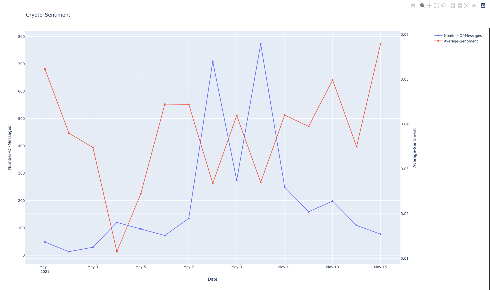

# Telegram Crypto.com | Sentiment Analysis

This project deals with a high level sentiment analysis of text messages(containg DOGE and SHIB coin conversations) from crypto.com channel in the telegram application. The date range of these messages is from 1st May to 15th May, 2021

## Running the project:

Create a python virtual environment

Clone this repository and install the required packages by using the following command.
```sh
pip install -r requirements.txt
```

Run the python file

```sh
python main.py
```
In this project, nltk is used for filtering english words and textblob is used for sentiment analysis (since it can also give the subjectivity of messages)
Code Workflow:
1.) Read and clean the data from the telegram export json file
2.) Filter messages that contain DOGE and SHIB coin conversations
3.) Filter out the non english messages and calculate the sentiment of each message
4.) Store the sentiment of each message in a list corresponding to the date in a dictionary
5.) Calculate the average sentiment of the conversations on a particular date along with the number of messages
6.) Plot this data using the plotly library


Results:



The resultant graph shows us that the sentiment during this period was mostly neutral, as the crypto market was highly volatile during this period. So the average positive sentiment and average negative sentiment was similar.
